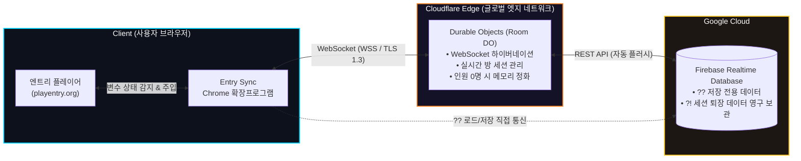

<div align="center">

  

  # Entry Sync (엔트리 싱크)

  ### 엔트리(Entry) 작품을 위한 초저지연 실시간 동기화 & 영구 클라우드 저장 솔루션

  <p align="center">
    복잡한 외부 서버 구축 없이, <strong>기호(??, !!, ?!)</strong> 하나로 완성하는<br />
    실시간 멀티플레이어와 안전한 클라우드 세이브 엔진.
  </p>

  <p align="center">
    <a href="https://entry-sync-site.pages.dev/"></a>
    <a href="https://chromewebstore.google.com/detail/ppkhmgmenfkjiajhfjpoepaldalhicll?utm_source=item-share-cb"></a>
    <a href="https://github.com/good-bad-code/Entry-Sync/blob/main/%EA%B0%9C%EC%9D%B8%EC%A0%95%EB%B3%B4%EC%B2%98%EB%A6%AC%EB%B0%A9%EC%B9%A8.md"></a>
  </p>

  <p align="center">
    
    
    
    
    
  </p>

  ---

  <p align="center">
    <a href="#-핵심-특징">핵심 특징</a> •
    <a href="#-4대-접두사-규칙">접두사 가이드</a> •
    <a href="#-시스템-아키텍처">시스템 아키텍처</a> •
    <a href="#-3분-퀵-스타트">사용법</a> •
    <a href="#-개발-및-배포">개발/배포</a> •
    <a href="#-보안-및-개인정보-보호">보안 정책</a>
  </p>

</div>

<br />

---

## 핵심 특징 (Key Highlights)

<table>
  <tr>
    <td width="50%">
      <h3>초저지연 실시간 멀티플레이</h3>
      <p>Cloudflare Workers의 <strong>Durable Objects</strong> 및 WebSocket 하이버네이션 기술을 통해 수십 명의 플레이어가 같은 엔트리 작품에서 딜레이 없이 부드럽게 좌표, 채팅, 상호작용을 나눕니다.</p>
    </td>
    <td width="50%">
      <h3>안전한 영구 클라우드 세이브</h3>
      <p>Google <strong>Firebase Realtime Database</strong>와 유기적으로 연동되어, 작품 정지 시 세이브 데이터가 자동 암호화 저장되고 재시작 시 자동으로 이전 값을 복원합니다.</p>
    </td>
  </tr>
  <tr>
    <td width="50%">
      <h3>단 3개의 기호로 끝나는 설정</h3>
      <p>복잡한 자바스크립트 코드나 별도 확장 블록 학습이 필요 없습니다. 변수/리스트 이름 앞에 <code>?!</code>, <code>!!</code>, <code>??</code> 기호만 붙이면 즉각 작동합니다.</p>
    </td>
    <td width="50%">
      <h3>개인정보 제로(Zero-PII) 원칙</h3>
      <p>사용자의 계정, 비밀번호, 결제 정보 등 개인식별정보는 단 하나도 수집하지 않습니다. Google Chrome 웹 스토어 보안 규정을 100% 준수합니다.</p>
    </td>
  </tr>
</table>

<br />

---

## 4대 접두사 규칙 (Prefix Guide)

엔트리 만들기 화면에서 변수 또는 리스트를 생성할 때 원하는 기능에 맞춰 이름 앞에 접두사를 붙여주세요.

| 접두사 | 대상 | 동작 메커니즘 | 저장 위치 및 수명 | 활용 예시 |
| :---: | :--- | :--- | :--- | :--- |
| <kbd>?!</kbd> | **연결 상태 변수**<br/>*(정확히 `?!` 단독)* | 작품 시작 시 기본값 `0`에서 연결 성공 시 `1`, 미연결 시 `-1`로 자동 전환 (블록 덮어쓰기 방지) | ❌ 저장 안 됨<br/>(일회성 연결 플래그) | `[?!] = [1] 일 때 온라인 모드 시작` |
| <kbd>!!</kbd> | **실시간 동기화 전용**<br/>*(변수 및 리스트)* | 동일 작품에 접속한 모든 플레이어 간 WebSocket 실시간 양방향 브로드캐스트 | 인원 0명 시 메모리 자동 파기<br/>*(DB 저장 안 됨)* | `!!플레이어X`, `!!플레이어Y`, `!!채팅로그` |
| <kbd>??</kbd> | **데이터 영구 저장 전용**<br/>*(변수 및 리스트)* | 작품 시작 시 Firebase에서 로드, 정지 시 Firebase에 클라우드 자동 저장 | Firebase Realtime DB<br/>*(영구 보관)* | `??내최고점수`, `??골드`, `??인벤토리` |
| <kbd>?!</kbd> | **동기화 + 영구 저장**<br/>*(변수 및 리스트)* | 플레이 중에는 실시간 동기화, 마지막 플레이어가 퇴장(인원 0명)할 때 Firebase에 최종 상태 백업 | WebSocket + Firebase<br/>*(퇴장 시 안전 보관)* | `?!공용창고`, `?!월드블록상태` |

<br />

### 엔트리 블록 코딩 예시

#### 1. 서버 연결 확인 후 작품 시작하기
```plaintext
[작품이 시작되었을 때]
  [만약 <( [?!] ) = (1)> 라면]
    [말하기: "멀티플레이 서버 연결 성공!"]
    [신호 (작품시작) 보내기]
  [아니라면]
    [말하기: "오프라인 모드로 전환합니다."]
```

#### 2. 실시간 멀티플레이어 좌표 이동 (`!!`)
```plaintext
[오른쪽 화살표 키를 눌렀을 때]
  [(!!내플레이어X) 에 (10) 만큼 더하기]
// 같은 방의 모든 참가자 화면에 즉시 동기화됩니다!
```

#### 3. 세이브 데이터 누적 (`??`)
```plaintext
[몬스터를 처치했을 때]
  [(??보유골드) 에 (50) 만큼 더하기]
// 작품이 정지되거나 브라우저를 닫아도 클라우드에 자동 보관됩니다!
```

<br />

---

## 시스템 아키텍처 (Architecture)

Entry Sync는 글로벌 엣지 컴퓨팅 기반의 **완전 무서버(Serverless) 분산 구조**로 설계되어 트래픽 급증에도 안정적으로 동작합니다.



<br />

---

## 3분 퀵 스타트 (Quick Start)

### 1단계: 확장프로그램 설치
- [Chrome 웹 스토어](https://chromewebstore.google.com/detail/ppkhmgmenfkjiajhfjpoepaldalhicll?utm_source=item-share-cb)에서 **Entry Sync**를 설치합니다.

### 2단계: 엔트리에서 변수/리스트 생성
- 엔트리 작품 제작 화면에서 원하는 변수/리스트 앞에 기호를 붙입니다.
  - 실시간 위치: `!!player_x`, `!!player_y`
  - 클라우드 저장: `??saved_coins`
  - 상태 감지: `?!`

### 3단계: 시작 버튼 클릭
- 작품 시작 버튼을 누르면 상태 변수 `?!`가 `1`로 바뀌며 실시간 세션과 클라우드 저장이 자동으로 활성화됩니다!

<br />

---

## 📂 프로젝트 구조 (Repository Structure)

```
Entry Sync/
├── extension/                 #  Chrome 확장프로그램 소스코드
|   ├── manifest.json          # MV3 매니페스트 설정
|   ├── content.js             # 엔트리 웹페이지 삽입 및 통신 브릿지
|   ├── inject.js              # 엔트리 엔진(Page World) 내부 변수 후킹 및 상태 주입
|   ├── popup.html             # 팝업 대시보드 UI
|   ├── popup.js               # 팝업 상태 모니터링 로직
|   └── icons/                 # 공식 아이콘 애셋
|
├── README.md
|
└── 개인정보처리방침.md
```

<br />

---

## 보안 및 개인정보 보호 (Privacy & Security)

Entry Sync는 사용자의 신뢰와 보안을 가장 중요하게 생각합니다.

- **개인식별정보 0%**: 이름, 이메일, 계정 비밀번호, 금융 정보, 브라우징 히스토리를 전혀 수집하지 않습니다.
- **암호화 통신**: 모든 네트워크 통신은 최신 TLS 1.3 / HTTPS 및 보안 WebSocket(WSS) 프로토콜을 통과합니다.
- **투명한 정책**: 자세한 내용은 [개인정보처리방침.md](./개인정보처리방침.md) 또는 [온라인 개인정보처리방침](https://entry-sync-site.pages.dev/privacy)에서 확인하실 수 있습니다.

<br />

---

## 기여 및 문의 (Contact & Feedback)

Entry Sync는 오픈소스 프로젝트이며 커뮤니티의 피드백과 기여를 언제나 환영합니다!

- **버그 제보 및 기능 제안:** [GitHub Issues](https://github.com/good-bad-code/Entry-Sync/issues)
- **개발팀 문의 이메일:** `syho2058@gmail.com`
- **공식 웹사이트:** [https://entry-sync-site.pages.dev/](https://entry-sync-site.pages.dev/)

<br />

---

<div align="center">

  <sub>Built with ❤️ for the Entry Creator Community</sub><br />
  <sub>© 2026 Entry Sync Team. 본 프로젝트는 네이버 커넥트재단 엔트리(Entry)와 공식 제휴되지 않은 독립 오픈소스 소프트웨어입니다.</sub>

</div>
